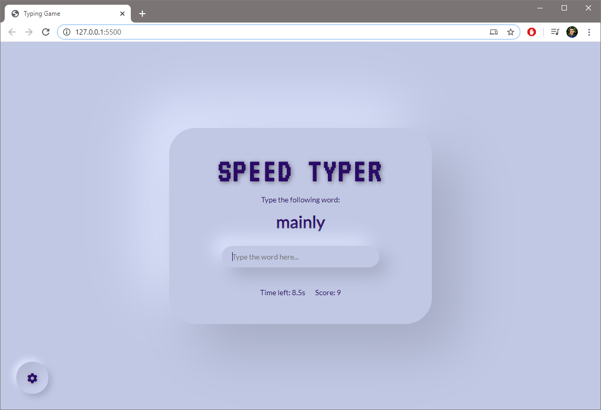
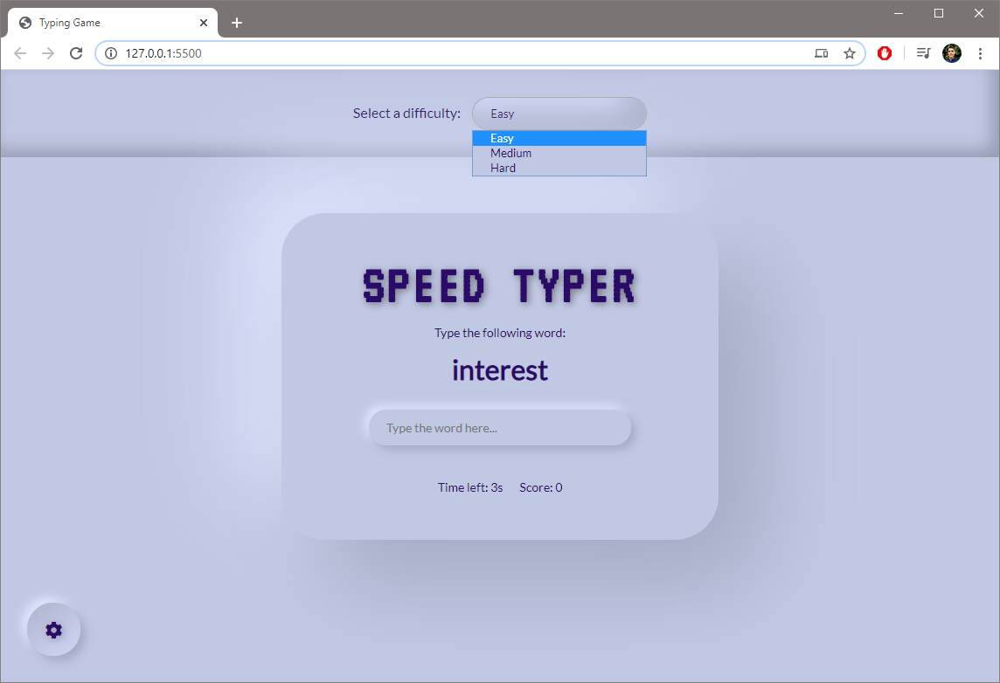
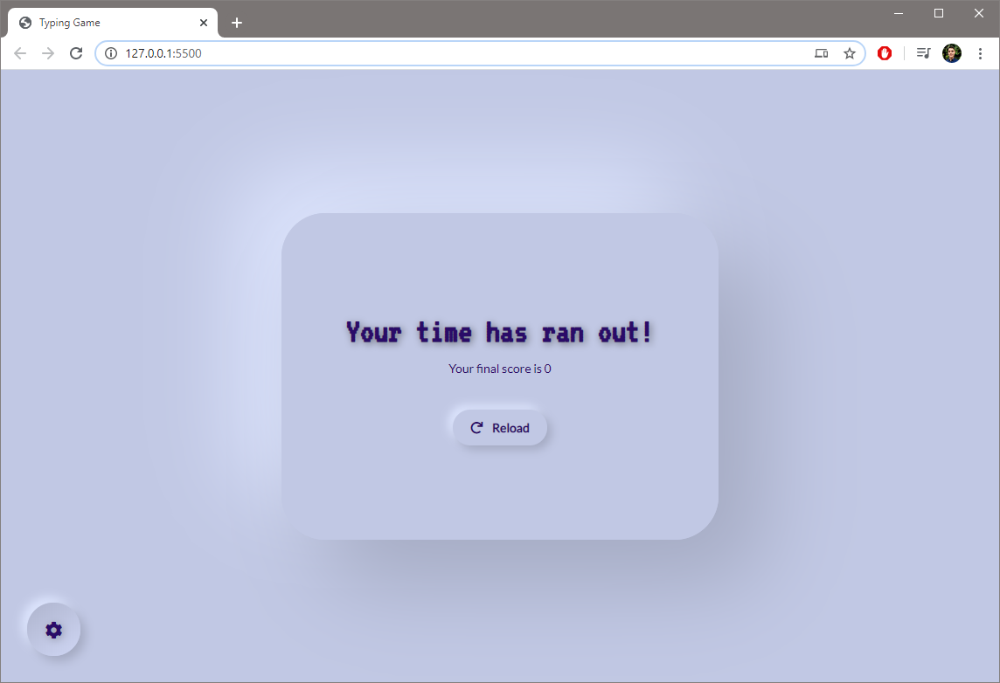

# Typing Game: A beautiful typing game to improve your typing skills.
by mrivas perez [live demo](https://mrivasperez.github.io/neumorphic-typing-game/)
## About
This is a beautiful, neumorphic designe, speed typing app builty with Vanilla JS, HTML, and CSS. I built it to help myself and other improve accurate typing skills!
## Screenshots

> A screenshot of the main page.

> A screenshot of the settings panel.

> A screenshot of a lost game

## Use
Run index.html in a browser.
Try it - [Typing Game](https://mrivasperez.github.io/neumorphic-typing-game/)

## Information
### Author
[Miguel Rivas Perez](https://github.com/mrivasperez)
### Tools used 
- [Neumorphism.io](https://neumorphism.io/#55b9f3)
### License

> This project is licensed under the [Unlicense](https://github.com/mrivasperez/neumorphic-typing-game/blob/master/LICENSE)